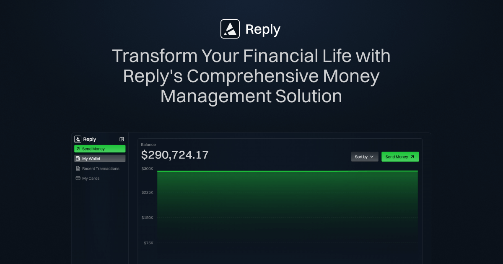
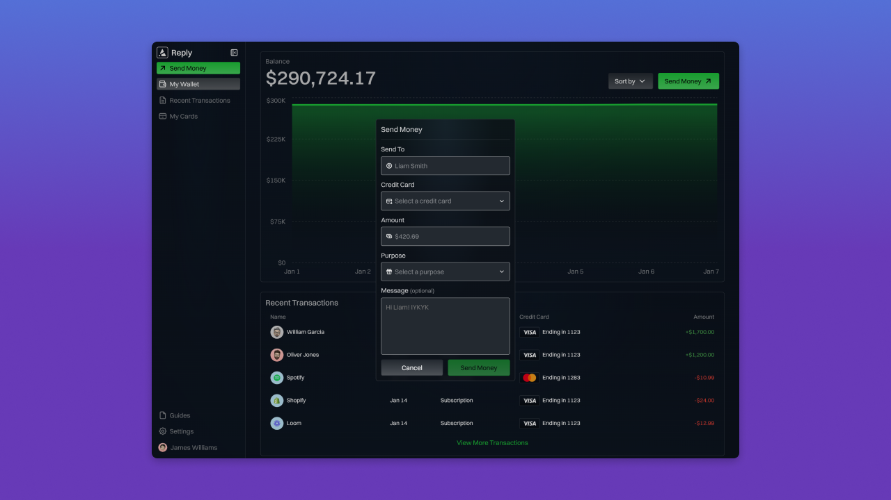
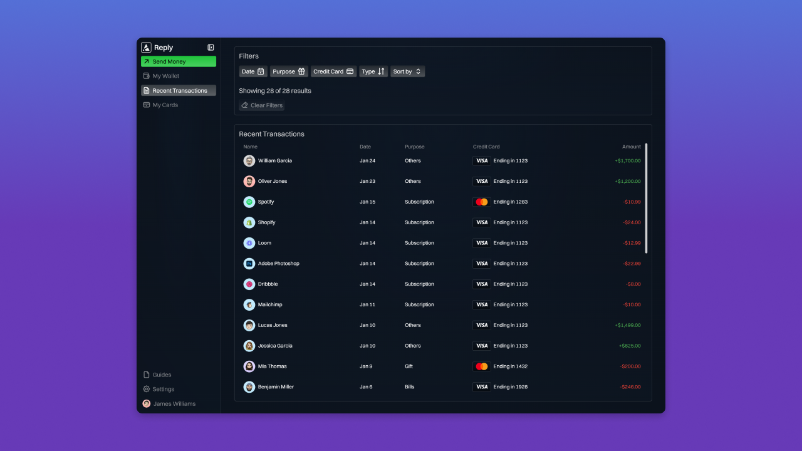
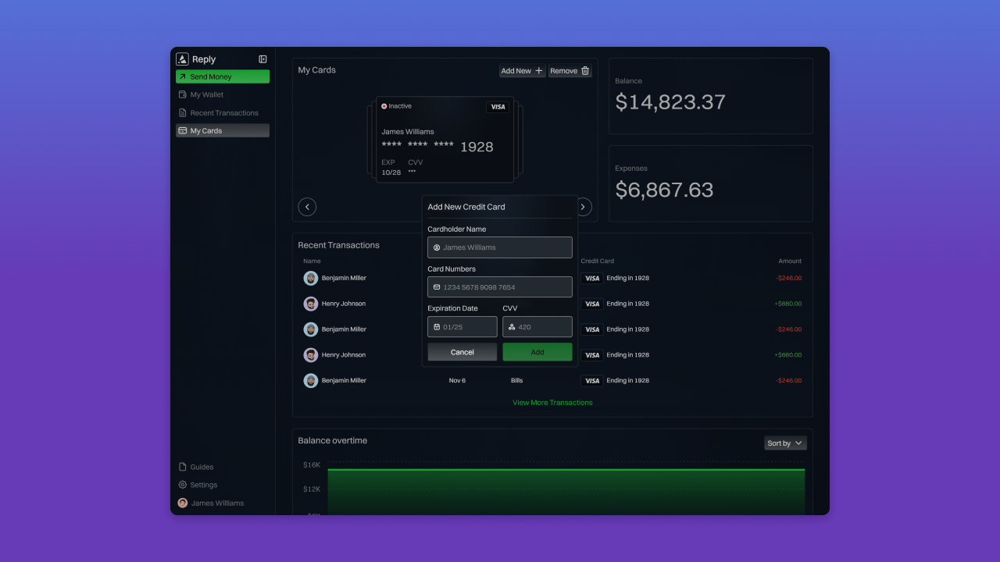
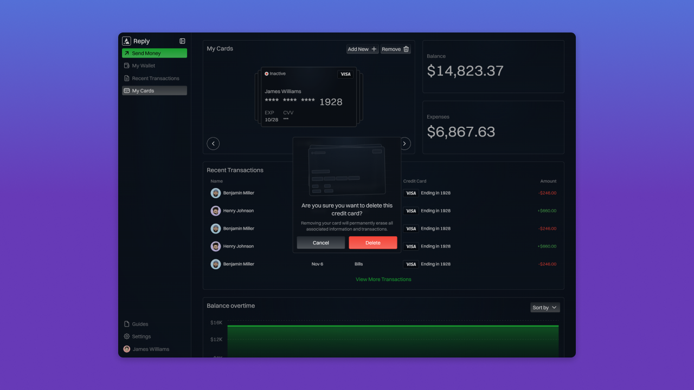
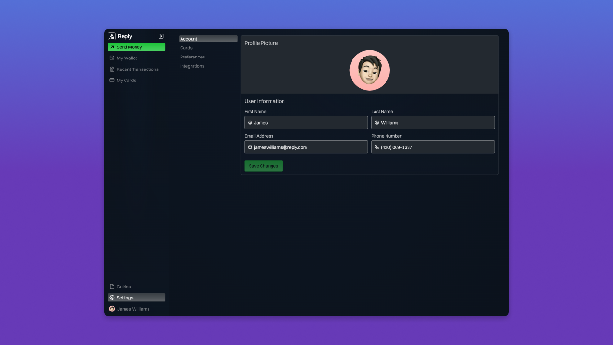
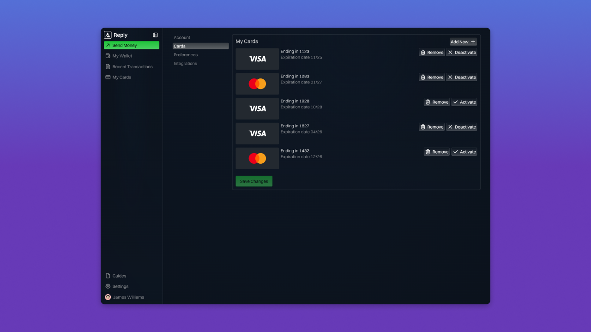
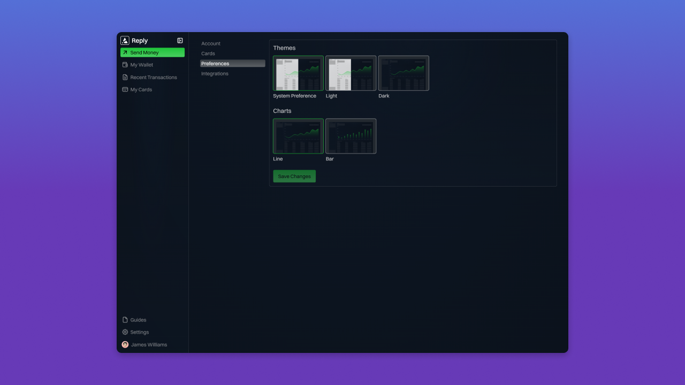
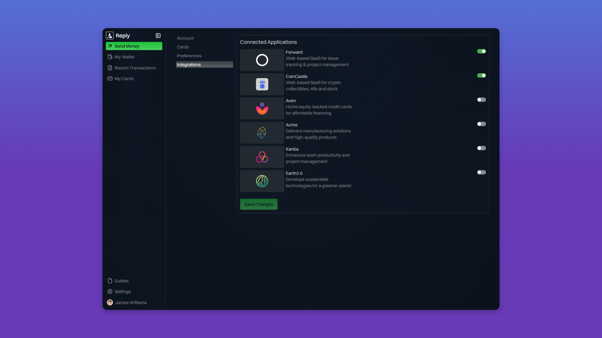

#  Reply

A web-based SaaS for Online Personal Banking

### Link for [Live Demo](https://reply-demo-app.netlify.app/)



## Table of Contents

- [Features](#features)
- [Tech Stack](#tech-stack)
- [Setup and Installation Instructions](#setup-and-installation-instructions)
- [License](#license)

## Features

### Sending Money

Initiate safe and fast money transfers directly within the app to friends, family, or businesses with just a few clicks.



### Filtering Transactions

Quickly find specific transactions by filtering based on date, amount, category, or merchant for streamlined financial tracking.



### Adding New Credit Cards

Easily add new credit cards to your account to expand your spending options and manage all your cards in one place.



### Removing Credit Cards

Effortlessly remove outdated or unused credit cards from your account to keep your financial profiles clean and secure.



### Updating User Information

Keep your profile current by updating personal information such as contact details, addresses, and security settings for better account management.



### Managing Credit Cards

Keep your credit card information organized and up to date with tools to view balances, track spending, and set payment reminders.



### Customizing Preferences

Tailor your app experience by adjusting personal settings and preferences for notifications, themes, and financial goals.



### Managing Integrations

Seamlessly connect and manage third-party apps and services to enhance your money management with additional data and functionality.



## Tech Stack

This project is built with the following technologies:

- **Framework:** React
- **Language:** TypeScript
- **Build Tool:** Vite
- **Styling:** CSS Modules

## Setup and Installation Instructions

Follow these steps to get the project running locally:

1. Clone the repository:
   ```bash
   git clone https://github.com/rveljko/reply.git
   ```
2. Navigate into the project directory:
   ```bash
   cd reply
   ```
3. Install dependencies:
   ```bash
   npm install
   ```
4. Configure environment variable:
   - Create a `.env` file with the following variables (you can create a free PostHog account and get your key and host at [PostHog Signup](https://us.posthog.com/signup)):
     ```
     VITE_PUBLIC_POSTHOG_KEY=
     VITE_PUBLIC_POSTHOG_HOST=
     ```
5. Start the development server:
   ```bash
   npm run dev
   ```
6. Open your browser and navigate to:
   ```
   http://localhost:5173
   ```

## License

This project is licensed under the [Apache License 2.0](LICENSE). See the LICENSE file for more details.
